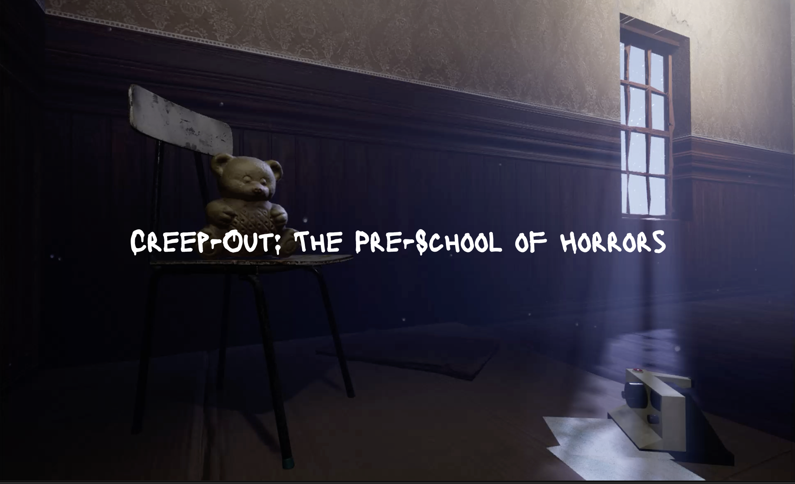
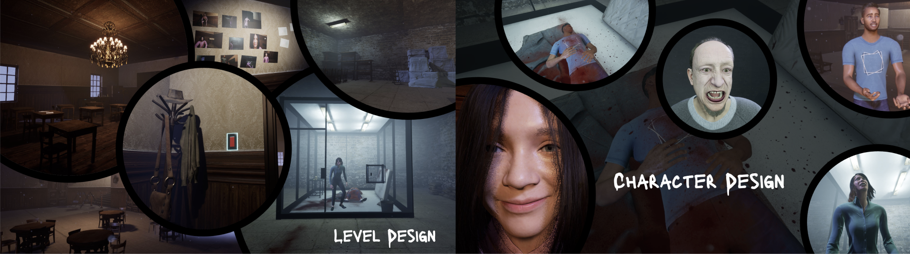

# Creep-Out VR: The pre-school of Horros

### Welcome to the GitHub project for the demo of Creep-Out VR: The pre-school of horros!
"It's like little Nightmares but in VR"

Press **[here](https://syncandshare.lrz.de/getlink/fiGBr9DgvzNa1A9wXbfQr8/Creep-Out%20Vr%20Demo.zip)** to download and try out the demo of our game **for free**.

Click **[here](docs/Creep-Out_VR_Demo_Walkthrough_Low.mp4)** you can watch a video walkthrough of our game

## Description

You’re the shy, timid pre-schooler Amelia, a young girl trapped in a horrifying school where a teacher has a sick obsession with you. The further you explore the school, the more you realize how twisted his plans are for you. So whatever you do, you can’t let this terrifying person catch you. Your final goal is to break out of the school, but this evil villain managed to trap your parents. Can you find your parents and be able to save them? Will you ever be able to escape this nightmarish school? Experience the first glimpse into this dreadful horror story with this demo of our game. But beware, do not fall off your seat!

## Installation and starting our game

Currently, our game only supports PCVR Gaming, therefore make sure you have the following applications installed on your Windows PC:
- Link App for your VR headset to be able to play PCVR (for example [Oculus Link](https://www.meta.com/de/quest/setup/) for Quest devices)
- [Steam](https://store.steampowered.com/) including [SteamVR](https://store.steampowered.com/app/250820/SteamVR/)

## Documentation

You will find the system requirements, the assets we used, as well as instructions for the game in the **[Documentation](docs/Creep-Out VR_ Documentation.pdf)**

Feel free to check out our **[Game Design Document](docs/Techdoc_Creep_Out.pdf)** as well.

This game is currently under development as part of a project for a course at Ludwig Maximillians University Munich and is done using [Unreal Engine](https://www.unrealengine.com/).

## Impressions

