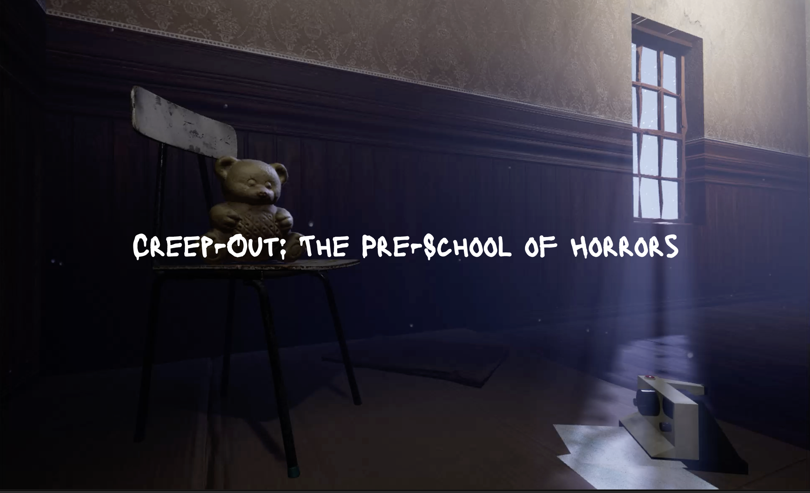
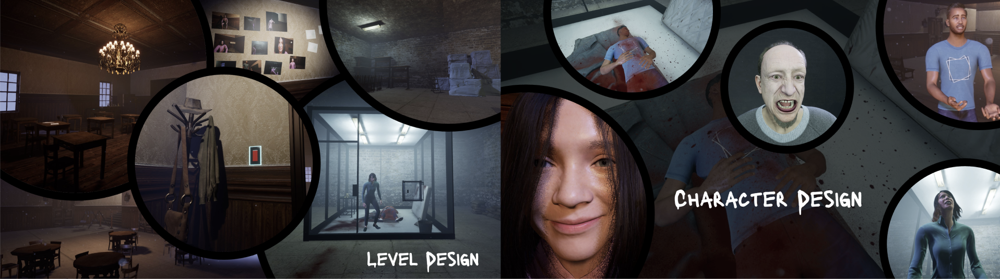

# Creep-Out VR: The pre-school of Horros
### "Like little nightmares, but in VR"

You’re the shy, timid pre-schooler Amelia, a young girl trapped in a horrifying school where a teacher has a sick obsession with you. The further you explore the school, the more you realize how twisted his plans are for you. So whatever you do, you can’t let this terrifying person catch you. Your final goal is to break out of the school, but this evil villain managed to trap your parents. Can you find your parents and be able to save them? Will you ever be able to escape this nightmarish school? Experience the first glimpse into this dreadful horror story with this demo of our game. But beware, do not fall off your seat!

Interested? Then **[try it](https://syncandshare.lrz.de/getlink/fiGBr9DgvzNa1A9wXbfQr8/Creep-Out%20Vr%20Demo.zip)** yourself

Run the game with Meta Link and your own Meta Quest VR headset!

&nbsp;
&nbsp;

## Description

As the game begins, you slowly wake up in a dimly-lit, quiet classroom. You’re Amelia, a shy preschooler, who has accidentally slept through evening class. The once familiar room now feels like a cage. The large classroom door is slammed shut, locking you inside. The oppressive silence is only broken by the distant echoes of twisted laughter. These laughters get louder and louder as you move closer to the door. Through the door, you glimpse your parents, embroiled in a heated argument with the school's janitor. Panic surges within you as you realize something is terribly wrong.
Every creak of the floorboards and flicker of the fluorescent lights sends shivers down your spine. You need to keep your wits about you to find the key that will unlock the door and lead you deeper into the school—each step you take bringing you closer to your trapped parents and revealing the horrifying truth.

Do you have what it takes to guide Amelia through her first fright and unravel the sinister mysteries in the school?

Don't know how to progress further? **[Spoiler](additional_files/Creep-Out_VR_Demo_Walkthrough_Low.mp4)** yourself with the progression by watching our walkthrough of the game.

## Installation and starting our game

Currently, our game supports PCVR Gaming, make sure to have the following installed on your Windows PC:
- Link App for your VR headset to be able to play PCVR (for example [Oculus Link](https://www.meta.com/de/quest/setup/) for Quest devices)
- [Steam](https://store.steampowered.com/) including [SteamVR](https://store.steampowered.com/app/250820/SteamVR/)

## System requirements

Minimum:
Processor: Intel i7-6700
Graphics card: Nvidia GTX 970
RAM: 16GB DDR3
Storage: at least 10 GB of free space

More info and the controller mapping in the **[Documentation](additional_files/Creep-Out_VR_Documentation.pdf)**

Wanna learn about this game's origin? Check out our [Game Design Document](additional_files/Techdoc_Creep_Out.pdf)!

## Impressions

